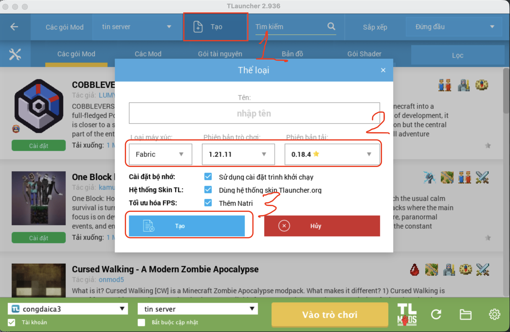
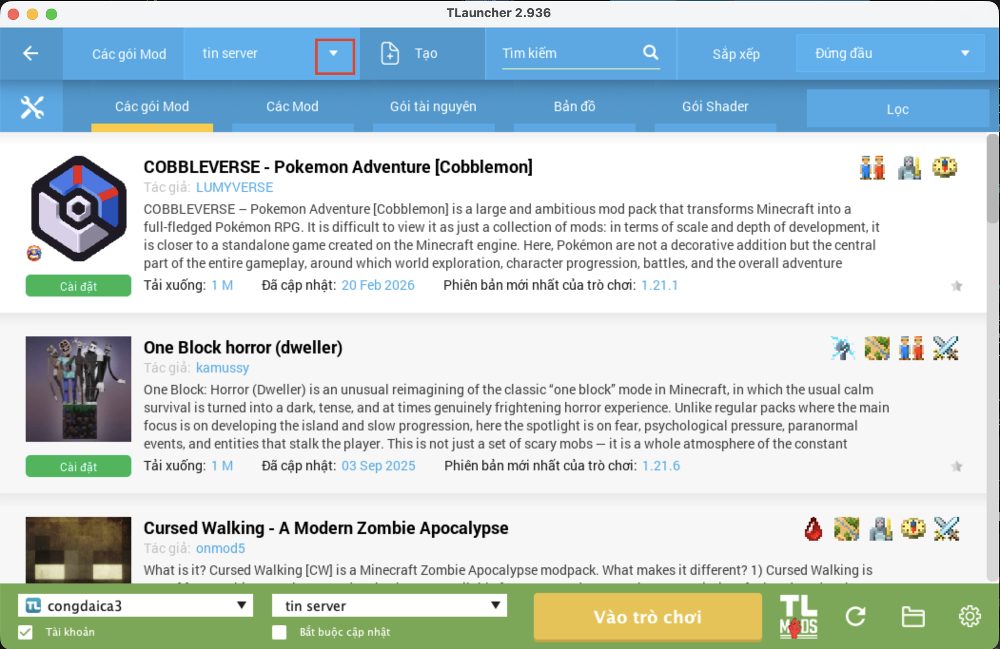
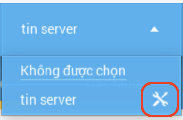
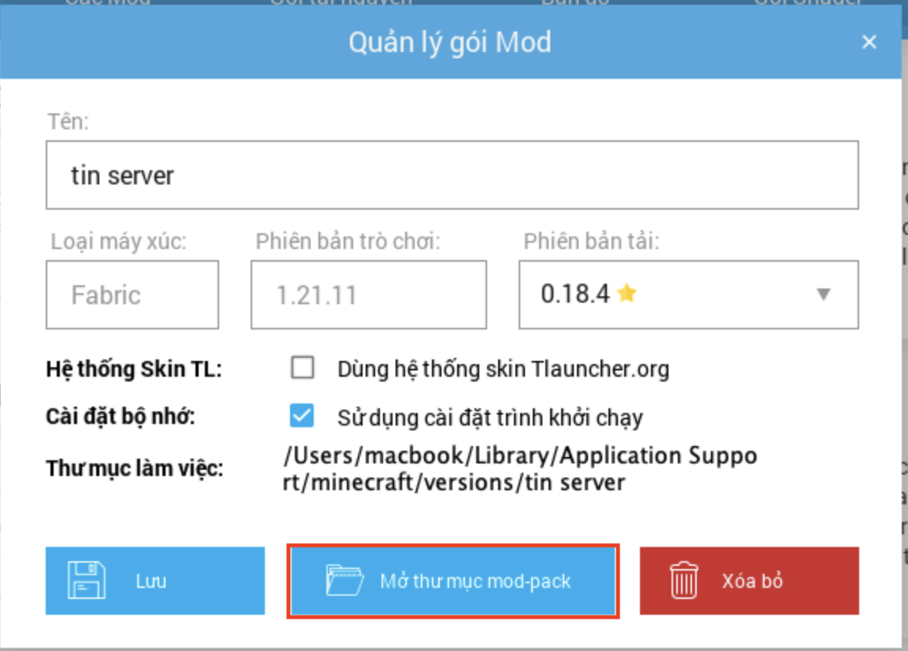
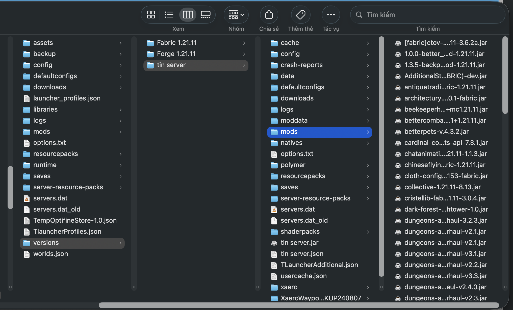
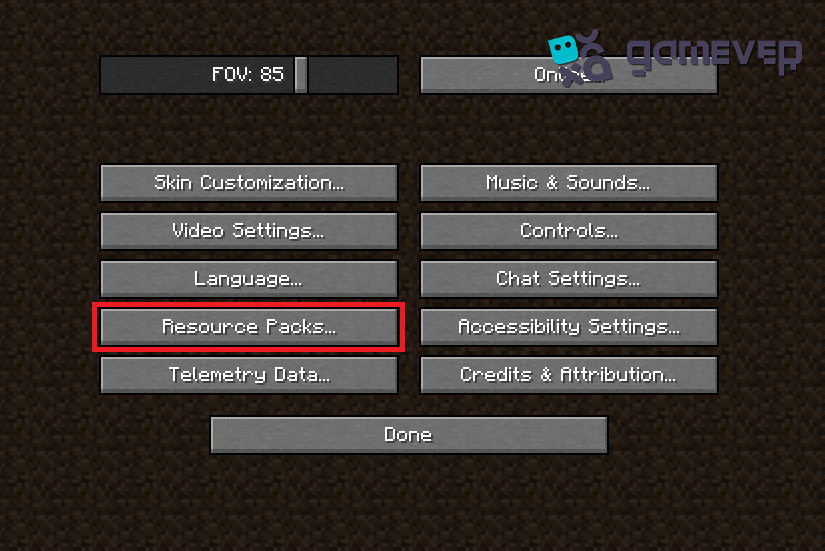

## TLaucher

Cách cài nhanh cho người mới:

1. ⭐ Cài đặt TLauncher: https://tlauncher.org/en
2. ⭐ Mở TLauncher, nhập username của bạn, sau đó bấm vào nút bên dưới.
   
3. ⭐ Bấm `Create`, chọn phiên bản như hình bên dưới, rồi xác nhận tạo.
   
4. ⭐ Sau khi tạo xong, bấm vào mũi tên để mở danh sách version.
   
5. ⭐ Chọn icon chỉnh sửa, chờ popup hiện lên, rồi bấm `Mở thư mục mod pack`.
   
6. ⭐ Chờ popup hiện lên, rồi bấm `Mở thư mục mod pack`.
   
7. ⭐ Copy mod vào đúng thư mục của version vừa tạo.
   
8. ⭐ Bấm `Bắt đầu chơi`, `Enter the game`, hoặc `Install` (nút vàng).
9. ⭐ Vào `Multiplayer` và dùng thông tin kết nối được cung cấp trong nhóm chat để vào server.

Lưu ý:

- TLauncher có thể có 2 thư mục mod: một thư mục dùng chung cho toàn game và một thư mục riêng cho từng version.
- Nếu bạn đang dùng Fabric, hãy bỏ mod vào thư mục mod của version vừa tạo.
- Copy xong là hoàn tất phần cài đặt mod.

## Configuration

- Server hostname (to connect): <b>`minecraft.mrsatdev.com` (no port)</b>
- Phiên bản Minecraft hiện tại: <b>1.21.11</b>
- Mod engine hiện tại: <b>Fabric 0.18.4</b>
- Java khuyến nghị: <b>Java 21.0+</b>
- RAM khuyến nghị: <b>4GB+</b>
   

### Additional settings

- <b>Mods:</b> Mặc định sẽ enable toàn bộ mods. Khuyến nghị bạn không nên thay đổi gì thêm như là cài thêm mods, etc, vì sẽ gây mất tương thích với phiên bản Minecraft và mod engine và sẽ bị lỗi khi kết nối tới server.
- <b>Resource pack:</b> Một số resource pack cần bạn <b>bật thủ công</b> trong menu <b>Resource Pack (ảnh bên dưới)</b>, tuỳ chỉnh theo sở thích của bạn vì nó chỉ thay đổi giao diện đồ hoạ ở máy của bạn, không ảnh hưởng tới server.
  
- <b>Shader:</b> Tương tự như resource pack, bạn có thể tuỳ chỉnh shader theo sở thích của bạn, nhưng khuyến nghị nên bật cho đẹp nếu máy bạn mạnh.
  Hiện tại chúng tôi đang sử dụng <b>Iris Shader</b>, bạn có thể truy cập menu của shader tại <b>Tuỳ Chọn Hình Ảnh</b> trong menu của game.

# 💻 Admin section

## Install Guide (for Detached server)

- Using docker-compose.yml file

## Install for LAN server

- Run minecraft instance on <b>modrinth</b> app
- Using latest version of <b>xxx.mrpack</b> file in <b>mrpack</b> folder to import server settings, mods, resource pack, etc.
